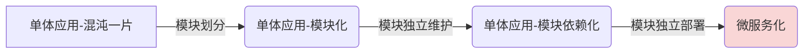

# 建设中 🔨

## 总体架构
> 待补充

## 项目结构

**拆分微服务**

> 待完善

**单体应用版本**

* 参考 [Kratos](https://go-kratos.dev/)、[go-zero](https://go-zero.dev/) 、[Domain-Driven Design](https://zhuanlan.zhihu.com/p/91525839)
* Service - Repository - DAO (Data Access Object) 三层结构 
  * service：领域服务（domain service），一个业务的完整处理过程
  * repository：领域对象的存储，存储数据的抽象
    * dao：数据库操作
    * cache 缓存操作
  * domain：领域对象
* handler（和HTTP打交道） → service（主要业务逻辑） → repository（数据存储抽象） → dao（数据库操作）

## 开发进度

**开发环境**

IDE🧑‍💻： [GoLand](https://www.jetbrains.com/go/)

OS🪟🐧：[Ubuntu 22.04.3 LTS (WSL2)](https://ubuntu.com/desktop/wsl)

**开发计划**

- [x] 用户服务 👤
  - [x] 注册、登录态校验与刷新
  - [x] 保护登录系统
  - [x] 优化登录性能
  - [x] 短信验证码登录
  - [ ] 微信扫码登录
  - [x] 长短 Token 与退出
- [x] 接入配置模块 ⚙️
- [x] 接入日志模块 📋️
- [x] 系统监控埋点 📹️
- [x] 文章服务 📃
  - [x] 新建、修改、保存和发布
  - [x] 阅读、点赞和收藏
  - [x] 榜单模型和缓存
  - [x] 分布式任务调度
- [ ] 评论服务 ✍
- [ ] 用户关系 🧩
- [ ] 搜索服务 🔍
- [ ] 即时通讯 💬
- [ ] 单元/集成测试 ✅

## 业务分析

**用户服务**

用户模块是一个非常常见的模块，几乎所有系统在记录用户信息时都需要这个模块。

* 登录系统的关键问题包括安全性、可用性和性能。安全性是最重要的，其次是可用性。虽然性能也很关键，但相对而言，登录是一个低频行为，因此性能问题不如前两者重要。如果用户频繁使用系统，则不应该让用户每次都登录。

* 安全问题主要关注的是如果有人试图入侵系统，登录过程将成为他们攻击的重点。相关知识点包括：

  * 加密算法
  * 保护 session 或 JWT token，并在这些信息泄露后，尽可能识别伪装成真实用户的攻击者
* 可用性问题则涉及到保证登录系统的稳定性，不会轻易崩溃。要提供多种登录方式，以便即使一种途径崩溃，仍有其他途径可用。例如，短信登录需要确保短信服务不会崩溃，或者在崩溃时提供备用方案。
* 在资源管理方面，可以考虑 JWT token 和长短期 token 的方案。需要理解使用 Session 和 JWT 的区别。

**短信服务**

基本的功能实现是比较简单的，重点难点在于：

* 需求分析能力：当实现像“验证码登录”这样的复合功能时，需要识别出应拆分出的独立模块。
* 接口抽象与扩展：掌握如何抽象出接口，并在接口基础上使用装饰器来扩展功能的技巧。
  * 重试机制：重试是常用的策略，需要考虑重试的间隔和次数。
  * 故障转移：简单的故障 转移方式是直接轮询，复杂的则需要动态判断下游服务的状态。
  * 客户端限流：实现客户端限流的策略
  * 同步转异步：转为异步后，需要考虑如何确保短信最终会发出去
 * 要注意并发问题，在这一过程中，Lua 脚本的使用尤为重要，虽然 Redis 是线程安全的，但它不能保证在连续执行多个命令时不会插入其他命令。

**文章服务**

* 理解内容生产平台常见的制作库和线上库的设计思路。虽然被称为制作库和线上库，它们可以是不同的数据库，也可以是同一数据库中的不同表。

- 文档型数据库：类似于 MongoDB 的 NoSQL 文档型数据库非常适合存储文章、帖子等内容。
- 多媒体存储：对于真正的多媒体内容，如图片、视频、音频等，使用 OSS（对象存储服务）加 CDN（内容分发网络）会更为合适。
- 数据库事务：需要学习手动控制事务，以及使用闭包事务。虽然闭包事务能够满足大多数场景的需求，但在某些特定场景下，仍需手动控制事务。

**榜单功能**

* 常见的榜单模型，只需要有基本了解，核心是记住榜单通常与用户行为正相关，与文章发表时间负相关。

* 榜单的整体计算过程稍微复杂，需要注意以下几点：

  - 优先级队列：用于维持榜单的前 n 名数据。

  - 分批次计算：因为无法一次性将所有数据加载到内存中，所以需要分批计算。
* 榜单的查询接口需要强调高并发和高可用性（位于应用的首页）：

  - 数据库崩溃：考虑到如果数据库崩溃，榜单是否仍能正确查询。
  - Redis 崩溃：考虑到如果 Redis 崩溃，榜单是否仍能正确查询。通常，使用 Redis 作为缓存就足够了。但在追求极高性能时，Redis 可能无法满足需求，需要使用本地缓存。此外，本地缓存未命中的情况也要尽可能避免。
  - 极致性能：在追求极致性能的情况下，本地缓存可能无法满足需求，可能需要考虑借助 CDN 等技术。
* 榜单的计算本身是一个定时任务，因此涉及到定时任务的调度。
  - 节点选择：有些定时任务，如榜单计算，只需要一个节点来执行。因此需要调度一个节点来执行任务，而不是所有节点都去执行，以避免资源浪费。
  - 负载均衡：在定时任务调度时，需要考虑负载均衡的问题。如果所有任务都被调度到同一个节点执行，该节点可能会过载。因此，需要选择负载最低的节点进行任务执行。在执行过程中，如果发现节点负载过高，立即中断任务并选择其他节点执行。

## 技术栈

**第三方库**

* [gin-gonic/gin](https://github.com/gin-gonic/gin) - HTTP web 框架
  * [Middleware](https://github.com/gin-gonic/contrib) - Collection of middlewares created by the community
  * [cors](https://github.com/gin-contrib/cors) -  Official *cross-origin resource sharing* (CORS) gin's middleware
  * [sessions](https://github.com/gin-contrib/sessions) - Gin middleware for session management
* [dlclark/regexp2](https://github.com/dlclark/regexp2) - full-featured 正则表达式
* [go-gorm/gorm](https://github.com/go-gorm/gorm) - The fantastic ORM library for Golang
  * [go-gorm/mysql](https://github.com/go-gorm/mysql) - GORM mysql driver
* [golang-jwt/jwt](https://github.com/golang-jwt/jwt) - Golang implementation of JSON Web Tokens (JWT)
* [tencentcloud-sdk-go](https://github.com/TencentCloud/tencentcloud-sdk-go) - Tencent Cloud API 3.0 SDK for Golang
  * [腾讯云 SMS](https://console.cloud.tencent.com/smsv2) 个人用户无法使用短信服务 API
* ~~[shansuma](https://gitee.com/shansuma/sms-sdk-master) - 闪速码 SMS 的 API 接口~~
* [wire](https://github.com/google/wire) - Compile-time Dependency Injection for Go
* [ekit](https://github.com/ecodeclub/ekit) - 支持泛型的工具库
* [mock](https://github.com/uber-go/mock) - GoMock is a mocking framework for the Go programming language
* [go-sqlmock](https://github.com/DATA-DOG/go-sqlmock) - Sql mock driver for golang to test database interactions
* [viper](https://github.com/spf13/viper) - Go configuration with fangs
* [etcd](https://github.com/etcd-io/etcd) - Distributed reliable key-value store for the most critical data of a distributed system
* [zap](https://github.com/uber-go/zap) - Blazing fast, structured, leveled logging in Go
* [mongo-go-driver](https://github.com/mongodb/mongo-go-driver) - The Official Golang driver for MongoDB
* [sarama](https://github.com/IBM/sarama) - Sarama is a Go library for Apache Kafka
* [prometheus](https://github.com/prometheus)/[client_golang](https://github.com/prometheus/client_golang) - Prometheus instrumentation library for Go applications
* [cron](https://github.com/robfig/cron) - a cron library for go 定时任务
* ~~[redis-lock](https://github.com/gotomicro/redis-lock) - 基于 Redis 实现的分布式锁~~
* [protobuf](https://github.com/golang/protobuf) - Go support for Google's protocol buffers
* [grpc-go](https://github.com/grpc/grpc-go) - The Go language implementation of gRPC. HTTP/2 based RPC

**相关环境**

* [Node.js](https://nodejs.org/en)
* [Docker](https://www.docker.com/)
  * [镜像源](https://yeasy.gitbook.io/docker_practice/install/mirror)（还是挂代理方便）
  * [mysql](https://hub.docker.com/_/mysql) - An open-source relational database management system (RDBMS)
  * [redis](https://hub.docker.com/r/bitnami/redis) - An open-source in-memory storage
  * [etcd](https://hub.docker.com/r/bitnami/etcd) - A distributed key-value store designed to securely store data across a cluster
  * [mongo](https://hub.docker.com/_/mongo) - MongoDB document databases provide high availability and easy scalability
  * [kafka](https://hub.docker.com/r/bitnami/kafka) - Apache Kafka is a distributed streaming platform used for building real-time applications
  * [prometheus](https://hub.docker.com/r/bitnami/prometheus) - The Prometheus monitoring system and time series database
  * *grafana - The open observability platform*
  * *zipkin - A distributed tracing system*
* [kubernates](https://kubernetes.io/)
  * [Kubernetes cluster architecture](https://kubernetes.io/docs/concepts/architecture/)
  * [kubectl](https://kubernetes.io/docs/tasks/tools/) - The Kubernetes command-line tool
  * [HELM](https://helm.sh/) - The package manager for Kubernetes
  * [ingress-nignx](https://github.com/kubernetes/ingress-nginx) - Ingress-NGINX Controller for Kubernetes
* [wrk](https://github.com/wg/wrk) - Modern HTTP benchmarking tool
* [protobuf](https://github.com/protocolbuffers/protobuf) - Protocol Buffers - Google's data interchange format

## 编程能力

**面向失败编程**

面向失败编程（Failure-oriented Programming，FOP）是一种编程范式，强调在编写逻辑时尽可能考虑边界条件和失败情况，以增强程序的稳定性。

简单来说，就是时刻考虑系统可能会崩溃。无论是系统本身、依赖的服务还是依赖的数据库，都可能会崩溃。

面向失败编程不仅仅是对输入进行校验，它还包括：

- 错误处理：需要严密处理各种可能的错误情况
- 容错设计：长期培养的能力是针对业务和系统特征设计容错策略。这通常是较难掌握的，而其余部分可以通过规范来达成。

在面向失败编程中，需要长期培养的能力是针对业务和系统特征设计容错策略。其他方面较容易掌握，或者公司可以通过规范来达成。

在项目中，我们讨论了许多容错方案，包括：

- 重试机制：需要考虑重试的间隔和次数，以及最后可能需要人工介入。
- 监控与告警：在追求高可用时，还要考虑自动修复的程度
- 限流：用于保护系统本身。
- 下游服务治理：如果下游服务可能崩溃，需使用一些治理技巧：
  - 轮询：可以是每次都轮询，也可以针对某个下游节点失败后的限流。
  - 客户端限流：限制客户端的请求速率以保护系统资源。
  - 同步转异步：在转为异步后，必须保证请求会被处理而不会遗漏
- 考虑安全性：例如，防止 token 泄露以增强系统的安全性。

在设计容错方案时，尽可能在平时收集别人使用的容错方案，以了解各种处理方式。根据自己实际处理的业务设计合适的容错方案。简单地生搬硬套别人的方案，效果可能不佳。

**灵活的缓存方案**

在整个单体应用中，已经充分接触了缓存方案。相比传统的缓存方案，项目中的缓存方案更具“趣味性”。在实践中，除非逼不得已，我通常不会使用看起来非常特殊的缓存方案。

使用过和讨论过的缓存方案包括：

* 只使用 Redis：更新缓存的常见方案是更新数据库后删除缓存。
* 本地缓存与 Redis 缓存结合使用。大多数系统完成这些步骤即可，
  * 查找顺序：本地缓存 -  Redis - 数据库
  * 更新顺序：数据库 - 本地缓存 - Redis
* 根据业务特征动态设置缓存的过期时间。例如，如果能判定某个用户是大 V，则他的数据过期时间应设得更长。
* 淘汰对象：根据业务特征来淘汰缓存对象。
* 缓存崩溃：需要考虑缓存崩溃的问题。在实践中，缓存崩溃可能导致数据库也一起崩溃。

在上述缓存方案的基础上，需要能够举一反三，根据业务特征设计针对性的解决方案。在整个职业生涯中，如果能有效使用缓存，就能解决 90% 的性能问题。剩下的 10% 则需要依靠各种技巧和优化手段。

**注意并发问题**

无论是代码中的 Go 实例，还是外部数据库，在实现任何功能时操作对象或 Redis 缓存数据时，都必须考虑并发问题。具体来说，需要关注是否有多个 goroutine 在同一时刻读写对象，这些 goroutine 可能在不同的实例（机器）上，也可能在同一实例（机器）上。

在项目中，使用了多种方法来解决并发问题：

- SELECT FOR UPDATE：用于确保读取的数据在操作期间不会被修改，简单且有效。
- 分布式锁：用于保证同一时刻只有一个 goroutine 可以执行特定操作。
- Lua 脚本：在 Redis 中使用 Lua 脚本来确保在执行多个操作时没有其他 goroutine 修改 Redis 数据。
- 乐观锁：使用数据库 version 加 CAS（Compare and Swap）机制来保证在修改数据时，数据未被其他操作修改过。
- Go 对象锁：使用 `sync.Mutex` 和 `sync.RWMutex` 来管理对 Go 对象的并发访问，在某些情况下，还可以使用原子操作（`atomic` 包）来处理简单的并发问题。

在实践中，只能通过长期训练来培养并发意识。在项目开始时，就应有意识地培养自己对并发问题的关注和敏感度。

**依赖注入**

首先要整体上领悟依赖注入和面向接口编程的优势，这些优点在项目中体现得非常明显：

- 依赖注入完全达成了控制反转的目标。我们不再关心如何创建依赖对象。例如，在 cache 模块中，虽然使用了 Redis 客户端，但 cache 实现并不关心具体的实现或客户端的相关参数。
- 依赖注入提高了代码的可测试性。我们可以在单元测试中注入由 `gomock` 生成的实例。在集成测试阶段，为了节省公司资源，第三方依赖通常被替换为内存实现或 mock 实现。
- 依赖注入叠加面向接口编程后，装饰器模式效果更佳。在我们的 sms 模块中，有各种装饰器的实现，这些实现都是基于面向接口编程和依赖注入的。这使得装饰器可以自由组合，提升了系统的灵活性和扩展性。
